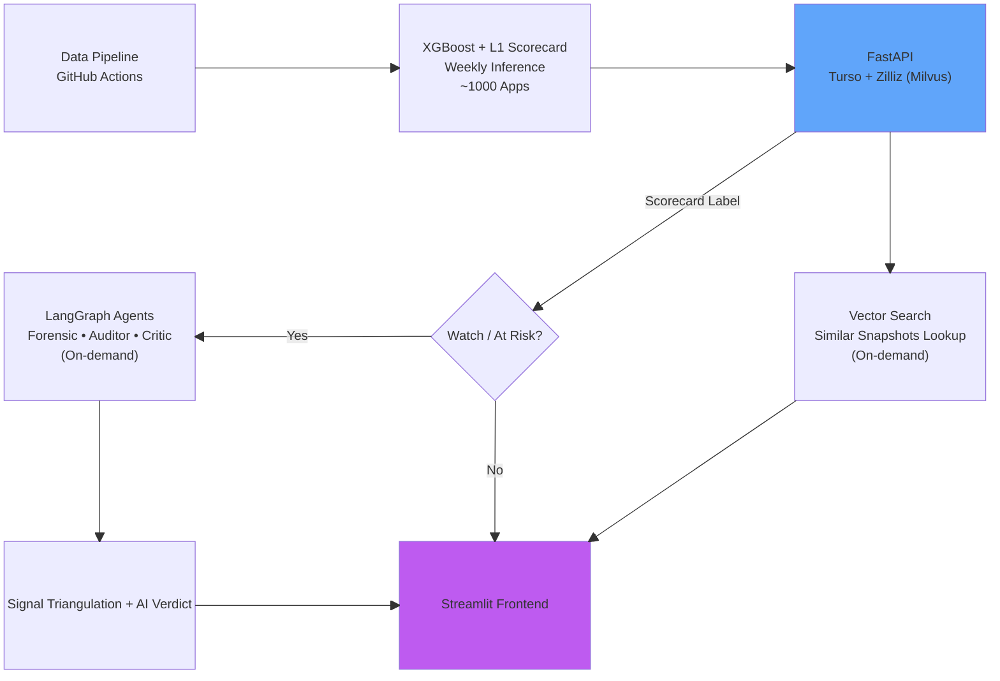
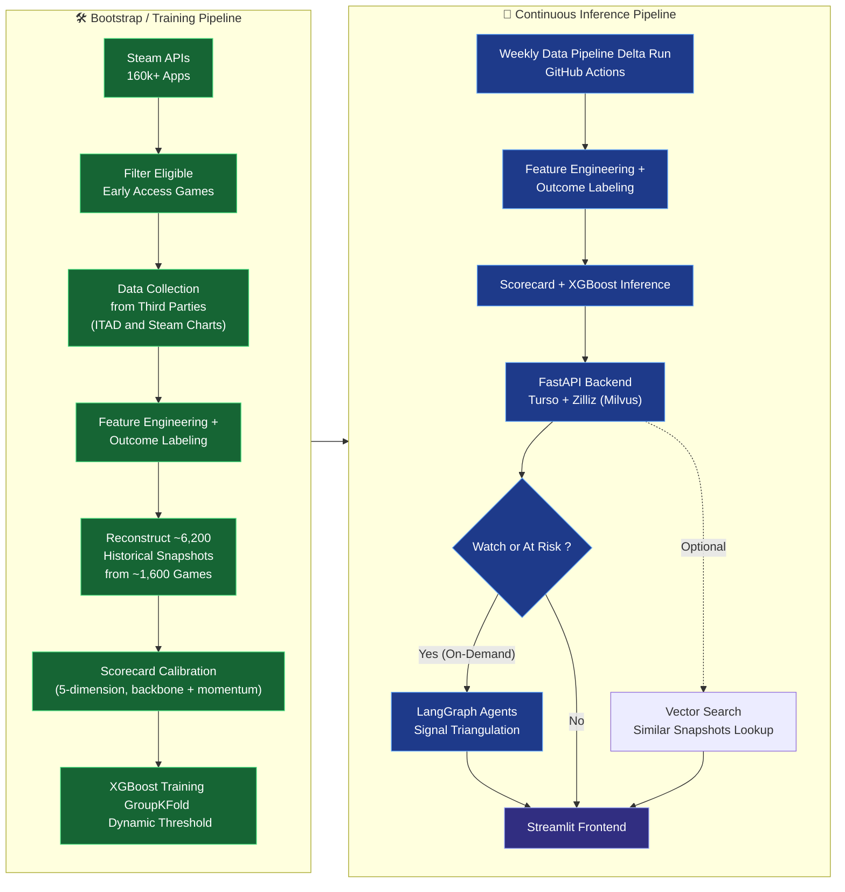

# EARLY — Steam Early Access Intelligence System (WIP)

**THIS README IS NOT THE FINAL VERSION. ALL INFORMATION IS SUBJECT TO CHANGE**

> **Can you tell a game is being abandoned before the developer says so?**

> EARLY answers that question by monitoring 1,000+ live Steam Early Access games, learning from ~1,600 historical outcomes, and surfacing early warning signals — weeks or months before a game goes silent.

<!-- INSERT: screenshot or short GIF of Streamlit "mission control" dashboard — dark theme, dimension meters, distress risk badge -->

🔴 **[Live Demo](https://early-system.streamlit.app/)** &nbsp;|&nbsp; 📄 **[Technical Documentation](docs/technical.md)**

> **⚠️ Important Disclaimer**
>* EARLY is an independent, unofficial analytical tool. It is not affiliated with, endorsed by, or connected to Valve, Steam, or any game developers.
>* All risk scores, predictions, and tier labels are statistical estimates based on historical patterns and publicly available data. Past performance does not guarantee future outcomes.
>* Predictions can be incorrect due to data limitations, concept drift, changes in developer behavior, or unforeseen events.
>* Self-fulfilling prophecy risk: Public visibility of risk signals could potentially influence developer or player behavior in ways that affect the predicted outcome.
>* EARLY should be used for informational and exploratory purposes only. It is not financial, investment, or purchasing advice.
>* Always verify information directly on Steam and perform your own due diligence. Do not base major decisions solely on this tool.
>* The authors assume no responsibility or liability for any decisions made based on EARLY's outputs.

---

## The Problem

30–40% of Steam Early Access games never reach a full release. They go quiet — updates slow, the developer stops responding, and players are left with an unfinished product they paid for. There is no official signal. Steam shows a basic warning if the last update was over 12 months ago, but this signal is very late. Review scores lag by weeks. By the time the community notices, it's already over.

Detecting abandonment early is genuinely hard:

- Steam exposes **no public API for "did this game actually ship code"** — build announcements are categories, not depot-verified signals. A developer can post a "major update" with no actual build attached.
- Useful signals (player concurrents, changelog word counts, dev response rates) are **scattered across multiple Steam endpoints** with no unified view.
- A model trained naively on snapshots will learn from the future — standard train/test splits **leak look-ahead information** for time-series game data, silently inflating every metric.
- The games that are hardest to call — Watch and At Risk — also have **2× more missing features** than Healthy games, so reliability degrades exactly where it matters most.

EARLY was built to navigate all of these, explicitly.

---

## What It Does

EARLY ingests the full Steam catalog (160,000+ apps via official APIs), filters to Early Access games with sufficient history, and runs a weekly pipeline that produces a **distress risk score** and **three-tier health label** (Healthy / Watch / At Risk) for each game.

For games showing warning signs, an **on-demand LLM agent layer** cross-checks three independent signal sources — the ML model, raw review sentiment, and the actual text of developer announcements — and flags when they conflict. A game that posts a "big update" announcement with hollow content while reviews say "no real changes in months" gets called out explicitly.



---

## Key Findings

**The reliability gap concentrates where it matters most.** At Risk games average 13.6 missing features per snapshot vs 5.2 for Healthy games — the games most in need of agent analysis are the ones the model is least confident about. `data_quality` (high/medium/low) is surfaced directly in the API response.

**Build announcements can still mislead.**  
Even though Steam’s event history API provides `build_id` and `build_branch` (when the developer supplies them), these fields are **optional** and frequently absent. During testing, a critical edge case was discovered: a game posted a standard Type-13 (regular update) announcement with an empty build signature—revealing that announcements categories do not guarantee actual code deployments.  

It broke a core assumption in the original model and triggered a major redesign of the agent layer — shifting its role from “explain the score” to “detect when independent signals disagree.”

<!-- INSERT: screenshot of Never Mourn game in the UI — Forensic Agent flagging event_state_mismatch, Critic verdict showing signal conflict -->

**Signal triangulation catches what a single model cannot.** The Critic Agent now runs a deterministic alignment check before any LLM call — comparing ML state, review sentiment direction, and forensic substance score. When all three agree, confidence is high. When they conflict, the verdict says so explicitly.

<!-- INSERT: screenshot or diagram of triangulation output — three signals, alignment result, verdict -->

---

## Architecture



---
## Tech Stack

| Layer | Tools |
|---|---|
| Data collection | Python, Steam Web API, ITAD API, Requests |
| ML model | XGBoost, scikit-learn, SHAP |
| Scorecard | Custom weighted engine |
| Agent layer | LangGraph, Groq (Llama 4 Scout + Llama 3.3 70B), Langfuse |
| Vector search | Zilliz (Milvus), cosine similarity, 25-dim SHAP vectors |
| API | FastAPI, Turso (libSQL) |
| Frontend | Streamlit |
| MLOps | MLflow model registry, PSI drift monitoring, DeepEval |
| Infrastructure | Docker, Docker Compose, GitHub Actions |

---

## ML Design Decisions Worth Noting

**GroupKFold by `appid`** — all snapshots from one game stay in the same fold. Without this, a model sees early snapshots of a game during training and later snapshots during validation, leaking temporal information.

**Dynamic Threshold from OOF PR Curve** — Instead of using a fixed 0.5 cutoff, the classification threshold is chosen dynamically based on the Precision-Recall curve from out-of-fold predictions. This better handles the class imbalance (~3:1 active vs abandoned) and allows tunable precision/recall trade-offs.


**Cosine similarity for SHAP vectors, not L2** — a Watch game and an At Risk game failing for the same underlying reasons would appear distant under L2 purely due to score magnitude. Cosine measures directional similarity — games failing for the same reasons cluster together regardless of severity.

**No imputation for Missing Values** — XGBoost handles nulls natively at prediction time. `pred_contribs=True` always returns a dense SHAP vector. An earlier design proposed mean-imputing null SHAP values; this was removed when confirmed unnecessary and potentially distorting.

---

## Agent Layer

The agent system is triggered **on-demand only** (never during the weekly batch run). Due to Groq rate limits, agent analysis runs only for Watch/At Risk games and results are cached in the database. Cached results remain valid until the game’s `l1_state` changes or 14 days pass.

**Forensic Agent**  
Analyzes the last 5 developer announcements for actual substance (not just recency). Detects “fake heartbeat” updates — announcements that suggest progress without corresponding build changes. Outputs include `momentum` trends and `event_state_mismatch` flags (e.g. the Never Mourn case).

<!-- INSERT: example Forensic Agent output — fake heartbeat case vs genuine update series -->

**Sentiment Auditor**  
Compares recent vs historical reviews to extract thematic signals (developer responsiveness, content drought, bug burden, etc.). Produces a `sentiment_alignment` score that explicitly checks consistency with the current ML `l1_state`.

**Critic Agent**  
First runs a fast deterministic alignment check (no LLM) across ML state, review sentiment, and forensic signals. Then generates two clear verdicts:
- `consumer_verdict` — player-facing plain language summary
- `developer_brief` — actionable insights for developers

When signals conflict, the verdict clearly states the disagreement.

<!-- INSERT: screenshot of Developer tab — developer_brief, key_concerns list, forensic detail expander -->

---

## Review Quality

Reviews are not taken at face value. Three adjustments are applied before sentiment scoring:

- **Meme discount** — high funny/helpful ratio on negative reviews reduces their weight
- **CJK-aware length scoring** — CJK characters weighted 2.5× vs Latin (character density difference)
- **Great Wall of Text guard** — line-level and token-level deduplication before scoring length; smart sentence-boundary truncation to 300 chars

---
<!-- NEED REVIEW -->
## MLOps

Four-stage plan, Stages 1–3 implemented:

**Stage 1 — Drift monitoring** (`monitor_drift.py`): PSI across top-25 SHAP features, prediction distribution, null-rate by tier, and delayed label drift. Runs post-inference in `score.yml`. Stores results in `drift_reports` table.

**Stage 2 — MLflow model registry** (`mlflow_client.py`, `promote_model.py`): every training run logs params, metrics, and artifacts. Promotion is gated — PR-AUC and per-tier outcome agreement are compared against current Production before transition. No-op stub when MLflow is not configured.

**Stage 3 — Conditional retraining** (`retrain.py`): scheduled or drift-triggered. Trains, compares against Production via the promotion gate, promotes only if metrics hold. Defaults to `--no-auto-promote` (human review recommended for first few cycles). Flags `--zilliz-rebuild-needed` if the SHAP top-25 feature set changes on promotion.

**Stage 4 (roadmap)** — XGBoost AFT survival analysis: reframe from binary classification to time-to-event prediction, modelling how much runway a game has rather than a binary distress flag.

---

## Testing
```bash
# Deterministic tests (no API key needed)
python tests/run_tests.py -m not_live
# Full agent tests (requires GROQ_API_KEY)
python tests/run_tests.py -m live
```

Agent tests use DeepEval. `fixtures.py` includes the Never Mourn case, a hotfix series, and edge cases. Deterministic tests cover `compute_signal_alignment` without any LLM call; live tests are auto-skipped if `GROQ_API_KEY` is unset.

---


## 📊 Results

**Model Performance (v1.3 Holdout Set)**

| Metric              | Value     |
|---------------------|-----------|
| AUC-ROC             | **0.9127** |
| PR-AUC              | **0.7382** |
| Lift over Scorecard | **+0.262** |

**Risk Tier Historical Accuracy** 
- **🟢 Healthy** → 98.2% success rate
- **🟡 Watch** → 74.9% success rate
- **🔴 At Risk** → ~48% success rate
<!-- ADD time tound eval & avg scorecard alignment -->
---

## Quick Start

```bash
git clone https://github.com/Yiu-dororong/EARLY.git
cd early
cp .env.example .env

# [Optional] Only fill in GROQ_API_KEY if you want to run live AI analysis.
# All other cloud integrations (Turso, Zilliz, etc.) are bypassable out-of-the-box using the pre-seeded local fallback data.

docker compose up
```

API: `http://localhost:8000` &nbsp;|&nbsp; UI: `http://localhost:8501`

---

## Project Structure

```
early/
├── .github/workflows/     # discover.yml · collect.yml · score.yml (daily/weekly cron)
├── agents/                # LangGraph: orchestrator, forensic, auditor, critic
├── api/                   # FastAPI routers, services, schema
├── core/                  # Feature builder, inference engine (shared)
├── data/                  # Collection scripts (Steam API) + processing
├── frontend/              # Streamlit app (single-file session-state router)
├── models/                # ML artifacts, SHAP top-25 contract, drift reference
├── tests/                 # DeepEval agent tests + fixtures
├── training/              # train_xgboost.py, scorecard, MLflow client, drift monitor
└── utils/                 # Langfuse client, ITAD client
```

---

## What This Is Not

EARLY does not predict whether a game will be *good*. It detects signals that a developer has slowed or stopped meaningful development. A game can score Healthy and still be mediocre. A game can score At Risk and recover — the system flags it, not sentences it.

<!-- INSERT: example of a Watch game that recovered — score history chart showing trajectory reversal -->

---

*Built by <!-- INSERT: your name/handle --> · <!-- INSERT: year -->*
