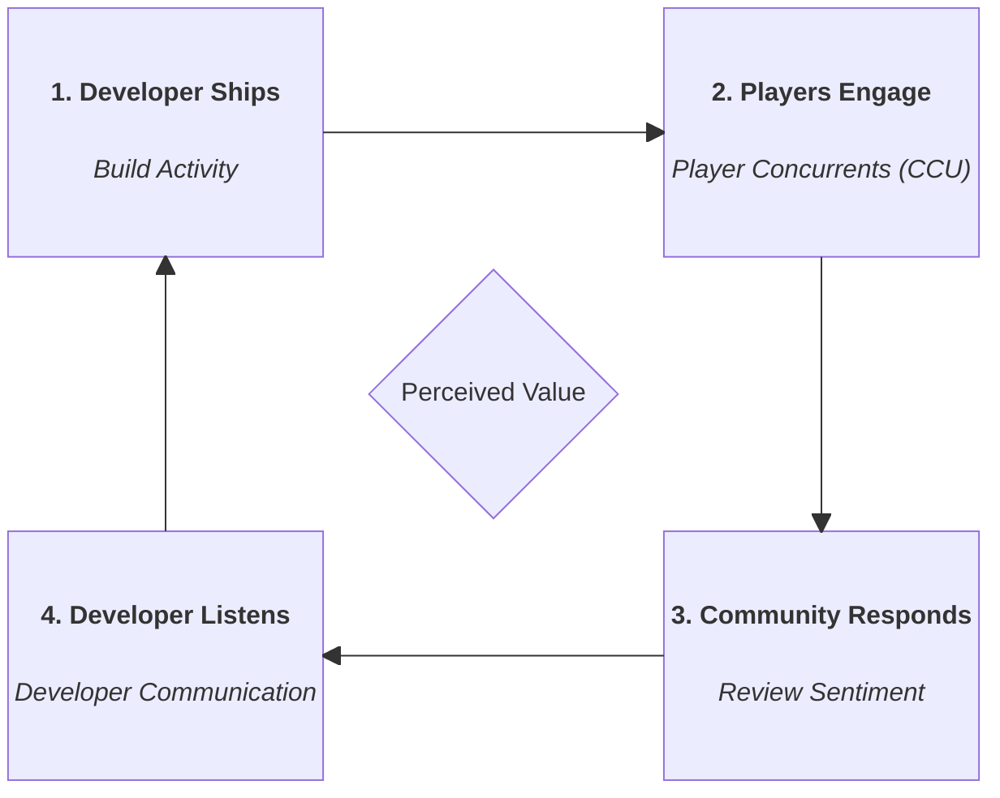

# Signals, Limitations & Roadmap

> This page exists because an honest accounting of what a system *can't* do is more useful than a list of what it can.   The limitations here are not apologies — most of them are responses to real constraints, with mitigations already in place or concrete plans to address them.

---

## Signals from the feedback loop

EARLY models Early Access games as a **development feedback loop** — the same cycle healthy software projects run continuously:
 
Each signal category maps to one stage of that loop:

| Signal | Source | Stage |
|---|---|---|
| **Build activity** | Steam event feed (types 12/13/14) | Developer ships — engineering output, update velocity, changelog substance |
| **Player concurrents** | Steam Charts | Players engage — live retention, whether updates are actually bringing players back |
| **Review sentiment** | Steam review API | Community responds — qualitative feedback, satisfaction trajectory, recent vs all-time delta |
| **Developer communication** | Steam event feed (type 28) | Developer listens — response cadence, transparency, active engagement with the player base |
| **Price & discount history** | ITAD API | External signal — pricing relative to genre peers acts as a structural proxy for perceived product value and developer confidence in the product |

*Coverage: ~1,000 live Early Access games, scored weekly. ~6300 historical snapshots from ~1,600 games used for training.*

When the loop is healthy, all four stages show activity. When it breaks down — updates slow, players leave, reviews turn, communication stops — the breakdown is rarely simultaneous. 

EARLY is designed to catch the earliest stage that falters.

---

## Known Blind Spots

### 1. No Depot Verification

Steam's public API exposes announcement event types but does not verify that a depot (actual build file) was updated. A developer can post a type-13 "build update" announcement with no actual build attached.

This is the core constraint that motivated the [Never Mourn case study](case-study.md) and the Forensic Agent's `event_state_mismatch` flag. The proxy (event types ≈ build activity) is the best available signal — it is not the same as the ground truth.

**Mitigation in place:** Forensic Agent cross-checks announcement content against the implied event type. `event_state_mismatch` is passed to the Critic Agent's alignment node and surfaces in the verdict.

**What's not solved:** A developer posting detailed, plausible-sounding patch notes for a build that didn't ship would still pass forensic analysis. The agent reads text, not depots.

### 2. The Reliability Gap Concentrates Where It Matters Most

At Risk games average 13.6 missing features per snapshot. Healthy games average 5.2. The model scoring an At Risk game is working with roughly half the information it has for a Healthy game — and doing so for exactly the games where the verdict matters most.

This is not a pipeline failure. Some features are genuinely unavailable for some games (e.g. CCU history for very low-population games, review scores for games with < 10 reviews). The null rate reflects real data sparsity, not collection errors.

**Mitigation in place:** `data_quality` field in every API response (high: ≤5 null features, medium: ≤15, low: 15+). `confidence_note` in Critic Agent output. Both surface explicitly in the Streamlit UI.

### 3. Label Imperfection — The Long Gap Success Problem

The current binary label (abandoned vs success) hides a third real outcome: a game that went dark for an extended period and then shipped. Under the current scheme, these games appear as `STAYS_ACTIVE` during the gap and `EXIT_SUCCESS` at exit.

This means the training data contains "developer stopped shipping for months" examples in the positive (non-abandoned) class. The model has learned, in part, from games that looked abandoned and weren't. This distorts the learned boundary between Watch and At Risk for games in genuine development limbo.

**Mitigation in place:** None yet — this is a known distortion, not a silent one.
**Roadmap:** See the 2×2 matrix redesign below.

### 4. Developer Intent Is Unobservable

The system measures observable developer behaviour — posts, builds, response rates. It cannot observe intent: a developer who is actively working on a major update but has chosen not to post about it will look like an abandonment case until the update ships.

This is an inherent limitation of any external monitoring system. The agent layer's `confidence_note` is the primary mitigation — verdicts include explicit caveats about what the system can and cannot see.

### 5. Build Gap Definition

The current `days_since_last_build_update` feature counts calendar days since the last type-12/13 event. A hotfix — a one-line patch for a critical bug — resets this counter the same as a major content update. This pulls the median down for games that are genuinely stagnant but occasionally ship trivial fixes.

**Roadmap:** Revise build gap definition to distinguish maintenance patches from content updates, using changelog word count and announcement substance as a filter. See near-term roadmap below.

---

## Mitigations Already In Place

| Limitation | Mitigation |
|---|---|
| No depot verification | Forensic Agent `event_state_mismatch` flag, Critic alignment node |
| Reliability gap by tier | `data_quality` field in API, `confidence_note` in Critic output |
| Hollow announcements | `fake_heartbeat_flag`, substance scoring, momentum across posts |
| Review meme bias | Meme discount factor (funny/helpful ratio weighting) |
| CJK review length | CJK characters weighted 2.5× vs Latin (also added translation for non-English language)|
| Low-confidence verdicts | `signal_alignment` field, explicit conflict surfacing |
| Model version traceability | `CONFIG_VERSION` per scored row, MLflow run tracking |

---

## Near-Term Roadmap

These are designed or partially specified — not yet implemented.

**Build gap definition revision**
Separate "any build event" from "substantive build event" using changelog word count as a proxy. A build event with `avg_changelog_word_count < 20` (patch/hotfix territory) would not reset the primary gap counter. A secondary `days_since_substantive_build` feature would run alongside the existing one. Requires re-evaluating the scorecard's update health backbone weights.

The current definition for `allowable_build_gap_days` is overly restrictive. Using the median to capture update frequency is easily distorted by high-frequency hotfixes, causing all training snapshots to default to the 365-day upper bound.

**Hard override review (`> 365` day build gap)**
The current hard override forces At Risk for any game with `days_since_last_build_update > 365` AND `ea_age_days > 90`. This was set conservatively at launch. After several months of scored data, the threshold and the interaction condition should be reviewed against actual outcome distributions — particularly for games in long-gap-success patterns that the override may be mislabelling.

**Redis / Upstash caching**
Currently deferred — Turso single-row lookups are sub-millisecond for the game detail endpoint, and the browse-all list endpoint doesn't exist yet. Revisit if a list endpoint becomes a bottleneck or if `GET /games/{appid}/analysis` polling under concurrent users creates read pressure.

---

## Long-Term Roadmap

### 2×2 Outcome Matrix

The most important labelling upgrade available. The current two-class scheme (abandoned vs success) collapses four real outcomes into two:

|  | Reached 1.0 | Did not reach 1.0 |
|---|---|---|
| **Kept shipping** | Exit Success | Stays Active (current EA) |
| **Stopped shipping** | Long Gap Success | Abandoned |

**Long Gap Success** — games that went dark and then shipped — are currently labelled `STAYS_ACTIVE` during the gap and `EXIT_SUCCESS` at exit. The model has learned from these as positive-class examples during their "stopped shipping" period, which distorts the Watch/At Risk boundary.

The fix introduces `has_long_gap` as a feature and potentially a new outcome class. The model would then learn that "stopped shipping then recovered" is a distinct pattern from "stopped shipping and abandoned" — and the scorecard could handle it explicitly rather than treating both as Watch.

This requires relabelling the historical dataset and retraining. It is the right next step after the current model has been validated over a full quarterly cycle.

### XGBoost AFT Survival Analysis

Reframes the problem from binary classification to **time-to-event prediction**. Instead of "will this game be abandoned," the model outputs a survival curve: the probability that a game remains active as a function of time remaining in Early Access.

Benefits over binary classification:
- Right-censored games (`STAYS_ACTIVE`) are handled honestly — they contribute to training without being forced into a positive or negative class
- The output is a curve, not a point estimate — uncertainty is native to the model, not bolted on
- "How much runway" becomes answerable directly, not inferred from `p_distressed`
- The Watch tier's ambiguity becomes quantitative — a wide confidence interval on the survival curve, rather than a label that means "we're not sure"

Requires switching to `survival:aft` objective, redefining labels as `(time, event/censoring_indicator)` pairs, and re-deriving all scorecard thresholds against survival curve outputs. Significant enough to warrant a separate design document before implementation.

### External Signal Integration

Several signals that are not currently collected could meaningfully improve coverage:

- **Social media activity** (Twitter/X, Reddit) — developer communication outside Steam. A developer who has gone quiet on Steam but is active on Reddit is a different case from one who has gone quiet everywhere.
- **SteamDB depot tracking** — SteamDB tracks actual depot changes (not just event types). Scraping or monitoring SteamDB would provide the ground truth build signal the public API lacks. Subject to terms-of-service review.
- **Kickstarter / crowdfunding status** — some EA games are crowdfunded. Campaign completion, backer updates, and platform status are independent signals not visible through Steam.

None of these are in scope for the current system — they are noted here as the natural next layer if EARLY were to be developed beyond a portfolio project.
