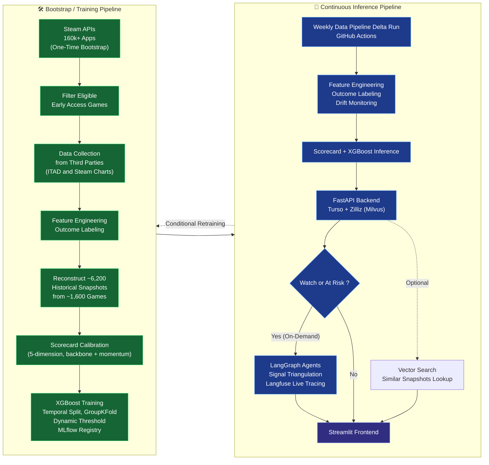

# EARLY — Technical Documentation

> This is the technical front door.  Each section links to a dedicated page designed to reveal the complete systemic footprint of the project,    while deeper pages trace specific engineering threads all the way down.
---

## What EARLY Is

EARLY is a solo-built, end-to-end AI decision support system for Steam Early Access game abandonment risk — surfacing warning signals weeks or months before a developer goes silent.

It is not a review aggregator or a sentiment dashboard. It is a **decision support loop**: six functions working in sequence, each adding a layer of context the previous one couldn't provide.

| Step | What it does |
|---|---|
| **Predict** | Distress probability and three-tier health label (Healthy / Watch / At Risk) |
| **Diagnose** | Which of the five signal dimensions are failing and by how much |
| **Investigate** | Forensic analysis of developer announcements, sentiment clustering across reviews |
| **Triangulate** | Check whether ML result, tier label, review sentiment, and forensic signals agree |
| **Explain** | Generates non-prescriptive, plain-language diagnostics tailored for both players and developers. |
| **Contextualise** | Similar historical games, data quality surfacing, confidence caveats |

The technical stack exists to serve this loop — not the other way around.

---

## System Overview

## Architecture

---

## Why This Problem Is Hard

Before reading anything else, it is worth understanding the constraints the system operates under — because most of the interesting design decisions are responses to them.

**Historical snapshot reconstruction has no explicit means.** To begin with, there is NO direct API filter or directory for Early Access titles, requiring a brute-force scan of the global 160,000+ app manifest database. Steam's public API is strictly transactional—it only exposes a game's current real-time state, systematically erasing its historical timeline. Moreover, the moment a game successfully graduates (releases 1.0), the original EA tag and erasing the EA release date will be overwritten in Steam.

**No ground truth signal for "did this game ship code."** Steam's public API exposes announcement event types (type 12/13/14 = "build update") but does not verify depot changes. This signal is noisy in both directions: a developer can spoof an update alert with zero code attached, and conversely, empty build_id fields don't definitively mean a patch didn't ship due to API omissions. The model treats these events as a proxy for update recency. It is highly gameable, which is precisely why the agent layer exists to cross-verify the noise.

**Look-ahead leakage is silent.** A game that eventually gets abandoned leaves signals throughout its history. A naive train/test split will put early snapshots in training and late snapshots in validation for the same game — the model learns from its own future. Standard splits feel fine; the metrics look reasonable; the model is invalid. GroupKFold by `appid` with temporal split is the fix.

**Reliability degrades exactly where it matters most.** At Risk games average 13.6 missing features per snapshot vs 5.2 for Healthy games. XGBoost handles nulls natively, but a model scoring a game on 11 features out of 25 is doing something meaningfully different from one scoring on 24. The system surfaces this as `data_quality` (high / medium / low) in every API response.

**The label itself is imperfect and time-specific.** "Abandoned" is defined by a moving window of developer silence, not terminal intent. This creates a snapshot-dependent labeling bias: a game that ultimately achieves a successful full launch (exit_success) will be falsely labeled as abandoned if an historical snapshot happens to be captured right in the middle of a long development hiatus. The current target framework conflates temporary hibernation with permanent project death—a known limitation with a concrete roadmap item to decouple them.

---

## Documentation Pages

| Page | What it covers |
|---|---|
| [The Problem & Design Premises](premises.md) | Why the problem exists, the five causal premises, eligibility criteria, what the system does not claim |
| [Data Pipeline](data-pipeline.md) | Steam API ingestion, labelling, the wrong turns |
| [Scorecard](scorecard.md) | L1 weighted engine, momentum layer, calibration history |
| [ML Model](ml-model.md) | Feature engineering, training design, evaluation, wrong turns |
| [Agents](agents.md) | LangGraph architecture, triangulation design, cost decisions |
| [Never Mourn](never-mourn.md) | Full case study: a build announcement that wasn't |
| [MLOps](mlops.md) | Drift monitoring, model registry, retraining gate |
| [Signals, Limitations & Roadmap](signals-limitations.md) | Honest scope accounting, mitigations, future work |

---

## Tech Stack

| Layer | Tools |
|---|---|
| Data collection | Python, Steam Web API, ITAD API, Requests |
| ML model | XGBoost, scikit-learn, SHAP, Optuna |
| Scorecard | Custom weighted engine |
| Agent layer | LangGraph, Groq (Llama 4 Scout + Llama 3.3 70B), Langfuse |
| Vector search | Zilliz (Milvus), cosine similarity, 25-dim SHAP vectors |
| API | FastAPI, Turso (libSQL) |
| Frontend | Streamlit |
| MLOps | MLflow model registry, PSI drift monitoring, DeepEval |
| Infrastructure | Docker, Docker Compose, GitHub Actions, Render, Streamlit Cloud |
---

## Key Numbers

| Metric | Value |
|---|---|
| Steam catalog ingested | 160,000+ apps |
| Snapshots in training dataset | ~6300 snapshots from ~1,600 games (labelled outcomes) |
| Live games monitored | ~1,000 |
| SHAP top-25 feature variance coverage | 82.2% |
| At Risk avg null features | 13.6 (vs 5.2 Healthy) |
| Agent cache TTL | 14 days or until `l1_state` changes |
| Similarity search | 5 nearest historical anchors, 3-pass filter relaxation |
